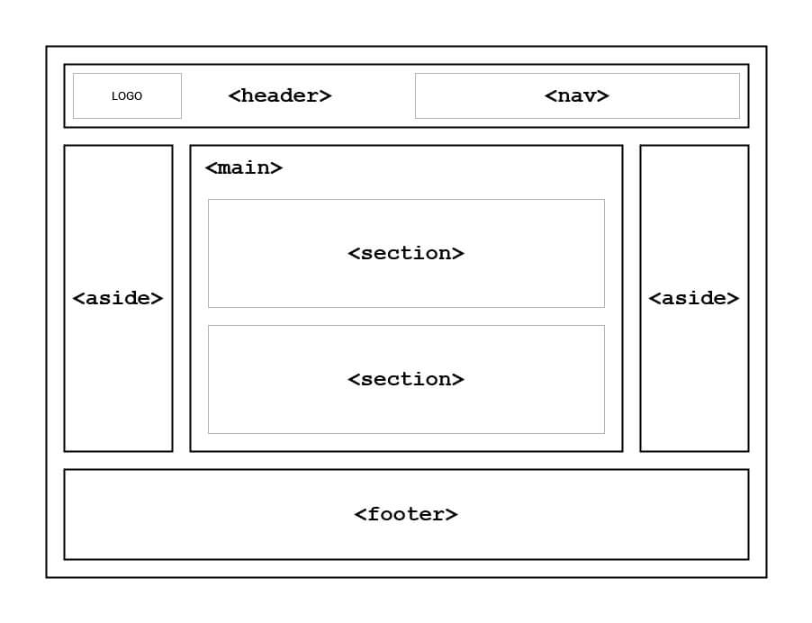

# 01_DWFE_20260226

git add .

git commit -m "texto"

git push

<!-- <body>
        <header>Cabeçalho</header>
        <section>
            <nav>Menu Lateral</nav>
            <main>Parte Principal</main>
        </section>
        <footer>Rodapé</footer>
</body> -->

